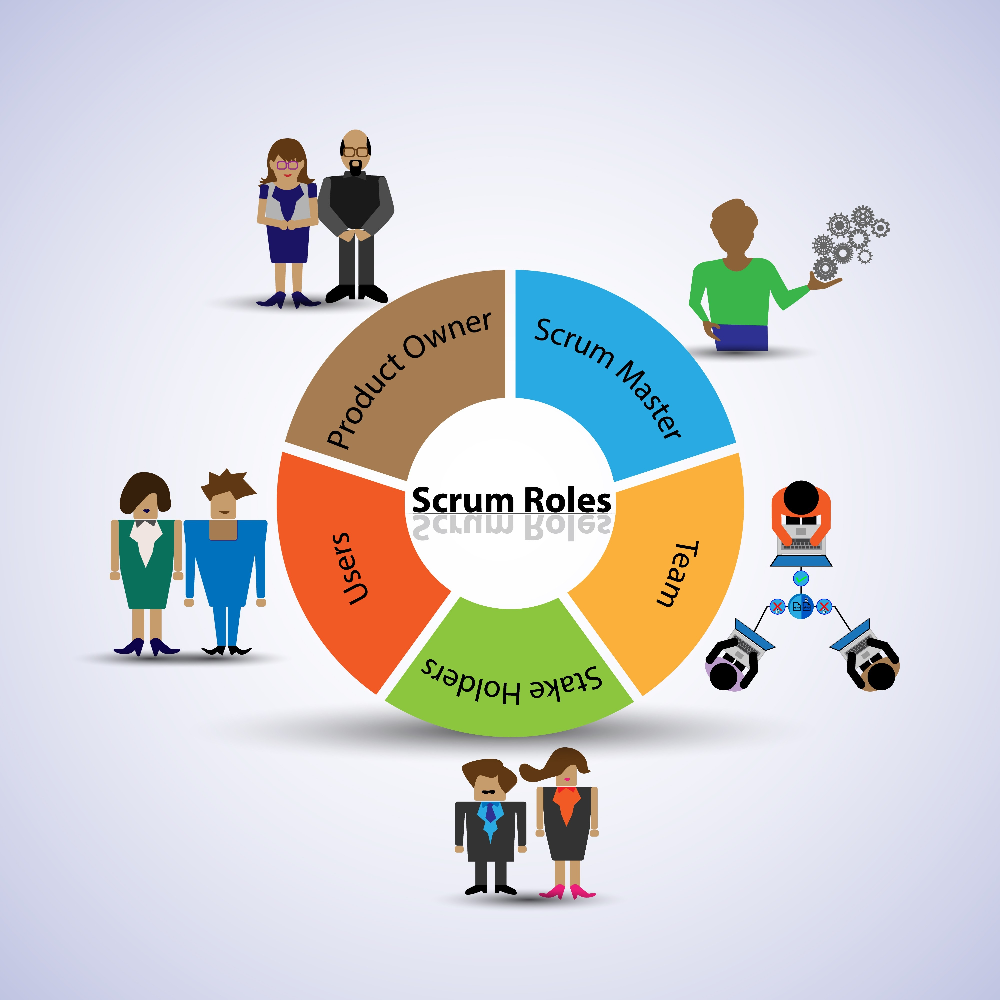

>lo que se busca es que el alumno desarrolle habilidades técnicas y blandas de forma integrada. La clave está en adaptar los roles, eventos y artefactos de Scrum a la dinámica del aula, usando las notas como el "presupuesto" que el cliente (profesor) invierte en el producto.

---

### **\#\# 1\. Estructura de Roles y Equipos 🎯**

 formar **dos equipos Scrum de 5 personas cada uno**. Un solo equipo de 10 es demasiado grande y dificulta la agilidad. Ambos equipos trabajarán en el mismo producto (el juego), pero quizás en funcionalidades diferentes o complementarias.

---

* **Product Owner (Dueño del Producto) \- Rol Profesor :**  
  * EL profesor es el cliente. la responsabilidad es **definir qué se va a construir** y en qué orden de prioridad.  
  * **Gestiona el Product Backlog:** Una lista priorizada de todas las funcionalidades deseadas para el juego (ej:"Diagrama DB" "Diagramas Clases" "Creación de personaje", "Sistema de puntuación", "Nivel 1", "Menú principal").  
  * **Aporta el "dinero" (las notas):** Al final de cada ciclo, el profesor "acepta" la/s funcionalidad/es terminadas que aportan valor, y esa aceptación se traduce en la calificación del equipo.  
  * El profesor es la única persona que puede decidir si una funcionalidad está "terminada" y cumple con los requisitos.  

---

* **Scrum Master (Facilitador) \- Rol Rotativo entre Alumnos:**  
  * No debe ser el profesor, para no mezclar roles. Cada equipo debe tener un Scrum Master.  
  * **Sugerencia:** Este rol debe **rotar cada uno o dos Sprints** entre los miembros del equipo. Esto permite que todos desarrollen habilidades de liderazgo, organización y resolución de problemas.  
  * Su función es asegurar que el equipo siga las reglas de Scrum, eliminar cualquier obstáculo que impida el avance (ej: "Profe, no entendemos cómo conectar a Firebase") y facilitar las reuniones. 

  --- 

* **Development Team (Equipo de Desarrollo) \- Los Alumnos:**  
  * Son los 5 miembros de cada equipo. Son **auto-organizados y multifuncionales**.  
  * Ellos deciden **cómo** construir las funcionalidades.  
  * Son responsables de estimar el esfuerzo, seleccionar el trabajo para cada ciclo y entregar un producto funcional al final.

---

### **\#\# 2\. El Flujo de Trabajo Scrum Adaptado al Aula 🔄**

Los **Sprints (ciclos de trabajo) de 1/2 semanas de duración**. Es tiempo suficiente para que desarrollen algo tangible y para que se pueda dar feedback frecuente.

#### **Fase 0: El Sprint Cero (Preparación)**

Una clase antes de empezar el primer Sprint:

1. **Visión del Producto:** Presenta la idea general del juego que quieres.  
2. **Creación del Product Backlog Inicial:** Realiza una lluvia de ideas con todos los alumnos sobre las funcionalidades que podría tener el juego. Escríbelas como **Historias de Usuario**. Por ejemplo:  
   * *"Como jugador, quiero registrarme con mi correo para guardar mi progreso."*  
   * *"Como jugador, quiero ver un tutorial al iniciar el juego por primera vez para aprender a jugar."*  
   * *"Como jugador, quiero que mi puntuación más alta se guarde para poder competir contra mí mismo."*  
3. **Configuración de Herramientas:** Asegúrate de que todos tengan acceso y sepan usar:  
   * **Git/GitHub:** Creen un repositorio central para el proyecto.  
   * **GitHub Projects:** Creen un tablero Kanban para cada equipo. Las columnas básicas deben ser: Product Backlog, Sprint Backlog (cosas por hacer en el Sprint), En Progreso, En Revisión y Hecho.  
   * **Android Studio y dependencias:** Entorno de desarrollo listo.

#### **El Ciclo de cada Sprint (2 semanas)**

1. **Sprint Planning (Planificación del Sprint) \- Lunes, 1ra hora:**  
   * **Qué se va a hacer:** Tú, como Product Owner, presentas las Historias de Usuario más importantes del Product Backlog.  
   * **Cómo se va a hacer:** Cada equipo de desarrollo debate, estima el esfuerzo (pueden usar una técnica simple como tallas de camiseta: S, M, L) y selecciona cuántas historias se compromete a completar en esas dos semanas. Es su decisión, no la tuya.  
   * **Resultado:** Se crea el **Sprint Backlog**, que es la lista de tareas que el equipo moverá a su tablero Kanban.  
2. **Daily Scrum (Reunión Diaria) \- 5-10 minutos al inicio de cada clase:**  
   * El Scrum Master de cada equipo modera. Cada miembro responde a tres preguntas:  
     1. ¿Qué hice ayer para ayudar al equipo a cumplir el objetivo del Sprint?  
     2. ¿Qué haré hoy?  
     3. ¿Veo algún impedimento que me impida avanzar?  
   * Esto fomenta la comunicación, la sincronización y la rápida identificación de problemas.  
3. **Sprint Review (Demostración) \- Viernes de la 2da semana, 1ra hora:**  
   * **¡El día de pago\!** Cada equipo demuestra el trabajo **funcional** que ha completado. No muestran código, muestran el incremento del juego funcionando en un emulador o dispositivo.  
   * Tú, como Product Owner, revisas cada funcionalidad y decides si cumple con los criterios de aceptación.  
   * **Si aceptas la funcionalidad, el equipo "cobra" (obtiene la nota asignada a esa historia).** Si no, la historia vuelve al Product Backlog para ser mejorada en un futuro Sprint.  
4. **Sprint Retrospective (Retrospectiva) \- Viernes de la 2da semana, última hora:**  
   * **Solo participa el equipo de desarrollo y su Scrum Master**. Tú no participas aquí para que ellos puedan hablar con total libertad.  
   * El objetivo es reflexionar sobre el proceso, no sobre el producto. Responden:  
     * ¿Qué salió bien en este Sprint?  
     * ¿Qué podría haber salido mejor?  
     * ¿Qué cambiaremos para el próximo Sprint?  
   * Esto es clave para la mejora continua.

---

### **\#\# 3\. Sistema de Evaluación (Las "Notas" como Dinero) 💰**

Este es el núcleo de la simulación.

* **Valora las Historias de Usuario:** Antes del Sprint Planning, asigna "puntos de valor" (que se traducirán en nota) a cada historia del Product Backlog. Las más complejas o importantes valen más. Por ejemplo:
  * "Redacción historias de usuario" \- 20 puntos
  * "Diseño Base de datos" \- 20 puntos  
  * "Login de usuario" \- 15 puntos  
  * "Menú principal con botones" \- 10 puntos  
  * "Mostrar puntuación final" \- 5 puntos  
* **La Nota del Sprint:** La calificación de cada equipo por Sprint es la suma de los puntos de las historias que tú **aceptaste** en la Sprint Review. Esto los motiva a entregar software funcional y de valor.  
* **Evaluación Individual:** La nota del Sprint es grupal, pero puedes complementarla con una evaluación individual basada en:  
  * **Coevaluación (Peer Review):** Al final de cada Sprint, cada alumno califica anónimamente a sus compañeros de equipo en base a su colaboración, comunicación y aporte.  
  * **Observación del Profesor:** Tu percepción sobre la participación en los eventos Scrum (especialmente el Daily Scrum) y el rol de Scrum Master.  
  * **Commits en GitHub:** Puedes revisar la frecuencia y calidad de las contribuciones individuales al código.

---

### **\#\# 4\. Uso de las Herramientas Tecnológicas 🛠️**

* **GitHub:** Es el corazón técnico. un flujo de trabajo básico como *Git Flow* (ramas **main**, **develop** y **feature**). Cada nueva funcionalidad del Sprint Backlog debe desarrollarse en su propia rama (**feature-login**, **feature-scoring**).  
* **GitHub Projects / Kanban:**  
  * La columna **Product Backlog** la gestionara el profe () principalmente tú, priorizando las historias.  
  * En el Sprint Planning, el equipo mueve las historias comprometidas a la columna **Sprint Backlog**.  
  * Durante el Sprint, los alumnos mueven las tareas por **En Progreso**, **En Revisión** (cuando un compañero debe revisar el código antes de integrarlo) y finalmente **Hecho**.  
* **Android Studio / Kotlin / SQLite / Firebase:** Son simplemente las herramientas que el equipo de desarrollo utiliza para construir el producto. Los problemas técnicos que encuentren son "impedimentos" que el Scrum Master debe ayudar a resolver, ya sea buscando ayuda en otro compañero, en el profesor o en internet.

>Con esta estructura, no solo se aprenderán las tecnologías mencionadas, sino que también se desarrollarán habilidades de negociación, trabajo en equipo, responsabilidad y adaptación al cambio, que son fundamentales en el mundo laboral actual.