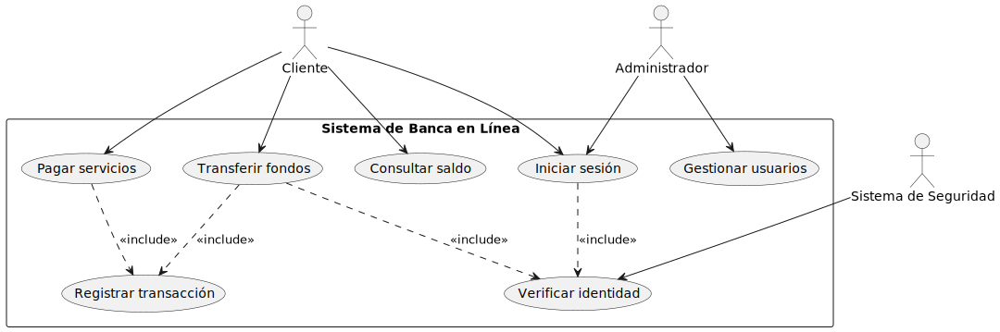

# CASOS DE USO

La relación entre casos de uso y requerimientos es fundamental en la ingeniería de software. Los casos de uso representan las interacciones entre usuarios y el sistema para lograr objetivos específicos, mientras que los requerimientos definen las capacidades y restricciones que debe cumplir el sistema.

### Ejemplo UC: Sistema de Biblioteca

**Explicación de relación con requerimientos:**

1. **Caso de uso**: "Buscar libro"
   - **Requerimiento funcional**: El sistema debe permitir buscar libros por título, autor, ISBN o categoría.
   - **Relación**: Este caso de uso implementa directamente el requerimiento funcional de búsqueda.

2. **Caso de uso**: "Prestar libro"
   - **Requerimiento funcional**: El sistema debe registrar préstamos asociando el usuario con el ejemplar y estableciendo una fecha de devolución.
   - **Requerimiento no funcional**: El proceso de préstamo debe completarse en menos de 30 segundos.
   - **Relación**: Implementa el requerimiento funcional de préstamo y debe satisfacer el requerimiento no funcional de rendimiento.

3. **Caso de uso**: "Enviar notificación"
   - **Requerimiento funcional**: El sistema debe notificar a los usuarios sobre préstamos, devoluciones y multas.
   - **Relación**: Es un caso de uso incluido por otros casos de uso para satisfacer el requerimiento de notificación.

**Identificación de Módulos:**
*   **Gestión de Usuarios:** UC4 (Registrar usuario)
*   **Catálogo y Búsqueda:** UC1 (Buscar libro)
*   **Gestión de Préstamos:** UC2 (Prestar libro), UC3 (Devolver libro), UC7 (Enviar notificación - *incluido*)
*   **Administración de Biblioteca:** UC5 (Generar reportes), UC6 (Catalogar libro)

### Ejemplo UC: Sistema de Banca en Línea

**Explicación de relación con requerimientos:**

1. **Caso de uso**: "Iniciar sesión"
   - **Requerimiento funcional**: El sistema debe autenticar a los usuarios mediante credenciales.
   - **Requerimiento no funcional**: El sistema debe cumplir con los estándares de seguridad bancaria ISO 27001.
   - **Relación**: Este caso de uso implementa el requerimiento funcional de autenticación y debe satisfacer los requerimientos no funcionales de seguridad.

2. **Caso de uso**: "Transferir fondos"
   - **Requerimiento funcional**: El sistema debe permitir transferencias entre cuentas propias y a terceros.
   - **Requerimiento funcional**: El sistema debe verificar fondos suficientes antes de realizar la transferencia.
   - **Requerimiento no funcional**: Las transferencias deben procesarse en tiempo real.
   - **Relación**: Este caso de uso implementa múltiples requerimientos funcionales y debe cumplir con el requerimiento no funcional de tiempo de respuesta.

3. **Caso de uso**: "Verificar identidad" 
   - **Requerimiento funcional**: El sistema debe implementar autenticación de dos factores.
   - **Relación**: Es un caso de uso incluido por otros para satisfacer requerimientos de seguridad.

**Identificación de Módulos:**
*   **Autenticación y Seguridad:** UC1 (Iniciar sesión), UC6 (Verificar identidad - *incluido*)
*   **Consultas:** UC2 (Consultar saldo)
*   **Operaciones Monetarias:** UC3 (Transferir fondos), UC4 (Pagar servicios), UC7 (Registrar transacción - *incluido*)
*   **Administración de Usuarios:** UC5 (Gestionar usuarios)

### Ejemplo UC: Sistema de Comercio Electrónico

**Explicación de relación con requerimientos:**

1. **Caso de uso**: "Buscar productos"
   - **Requerimiento funcional**: El sistema debe permitir buscar productos por nombre, categoría y filtros avanzados.
   - **Requerimiento no funcional**: Las búsquedas deben mostrar resultados en menos de 1 segundo.
   - **Relación**: Implementa los requerimientos funcionales de búsqueda y debe cumplir con el requerimiento no funcional de rendimiento.

2. **Caso de uso**: "Realizar checkout"
   - **Requerimiento funcional**: El sistema debe permitir seleccionar método de pago y dirección de envío.
   - **Requerimiento funcional**: El sistema debe calcular impuestos y costos de envío.
   - **Relación**: Este caso de uso implementa múltiples requerimientos funcionales y utiliza casos de uso incluidos para completar la funcionalidad.

3. **Caso de uso**: "Procesar pago"
   - **Requerimiento funcional**: El sistema debe integrarse con pasarelas de pago seguras.
   - **Requerimiento no funcional**: Las transacciones deben estar cifradas con SSL.
   - **Relación**: Es un caso de uso incluido que implementa requerimientos funcionales y no funcionales específicos de seguridad y procesamiento de pagos.

**Identificación de Módulos:**
*   **Gestión de Cuentas:** UC1 (Registrarse)
*   **Catálogo y Navegación:** UC2 (Buscar productos), UC3 (Ver detalles del producto)
*   **Carrito y Compra:** UC4 (Agregar al carrito), UC5 (Realizar checkout), UC6 (Procesar pago - *incluido*), UC8 (Generar factura - *incluido*)
*   **Administración de Inventario:** UC7 (Gestionar inventario)

### Mejores prácticas para relacionar casos de uso y requerimientos:

1. **Trazabilidad**: Cada caso de uso debe estar vinculado a uno o más requerimientos.

2. **Completitud**: Los casos de uso, en conjunto, deben cubrir todos los requerimientos funcionales.

3. **Detalles**: Los escenarios y flujos alternativos de casos de uso suelen derivarse de requerimientos específicos.

4. **Documentación**: Mantener matrices de trazabilidad entre casos de uso y requerimientos.
